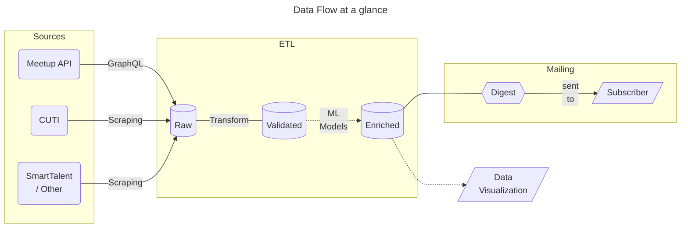

# Achitectural Overview
### **Assumptions and concepts**
BytesOfUY is an automated weekly digest meant to provide a detailed calendar of IT events happening in Uruguay (UY) to interested subscribers by email. In UY there are two main sources of information that disseminate these kind of events:

* a) Meetup, where different groups gather by a common interest (e.g., AI, Cloud, Ruby, etc.)
* b) CUTI (*Uruguayan Chamber of Information Technology*), which provides events and courses hosted by different organizations
* c) At the same time, there are other smaller sources that also inform or provide events such as SmartTalent

The need for this software arises due that source `b` doesn't provide a newsletter of events as `a` or `c` do, making it necessary to access their website and look for them. Thus BytesOfUY aims to fill this niche by providing said functionality while at the same time centralizing all different sources, making it easier for the end user to be up to date with the happenings in the realm of IT in UY. To make this possible, BytesOfUY is developed with the following data flow in mind:

<div align="center">



**Notes:** *ETL: This process runs on a medallion architecture principle, dotted lines: features to be developed at later stages that are not part of the MVP*

</div>

### **Components**

[To be filled]

By the end of the ETL process, the enriched data is loaded in a traditional relational database with the following Entity Relationship Diagram (ERD):
<div align="center">

```mermaid
---
title: Entity Relationship Diagram
---
erDiagram
    EVENT ||--|{ CATEGORY : "belongs to"
    EVENT {
        str event_id PK
        str title
        str description
        date date
        str location
        str source
    }    
    CATEGORY {
        str category_id PK
        str name   
        %%str description
    }
    EVENT ||--|{ DIGEST : "queued for"
    SUBSCRIBER ||--|{ DIGEST : receives
    SUBSCRIBER {
        str subscriber_id PK
        str email
        date subscription_date
    }
    DIGEST {
        str queue_id PK
        date queued_date
    }
    %%{`
        CATEGORY }|--|{ DIGEST : through
        Possible relationship in case the digest
        is thematic (e.g. a digest for course,
        another for talks, etc.)
    `}%%
```

</div>

[Justify the choice of data model and data architecture]