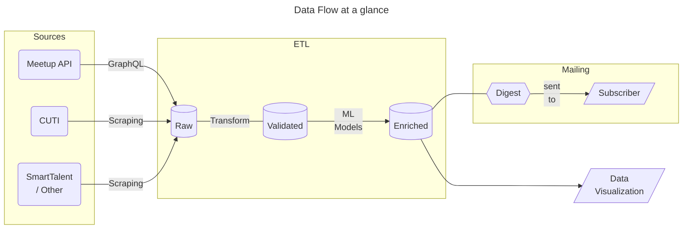
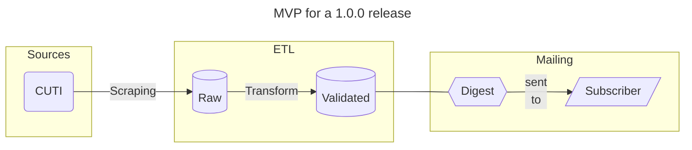

# Achitectural Overview
### **Assumptions and concepts**
BytesOfUY is an automated weekly digest meant to provide a detailed calendar of IT events happening in Uruguay (UY) to interested subscribers by email. In UY there are different sources of information that disseminate these kind of events:

1. Meetup, where different groups gather by a common interest (e.g., AI, Cloud, Ruby, etc.).
2. CUTI (*Uruguayan Chamber of Information Technology*), which provides events and courses hosted by different organizations.
3. At the same time, there are other smaller sources that also inform or provide events such as SmartTalent (among others).

The need for this software arises due that source `b` doesn't provide a newsletter of events as `a` or `c` do, making it necessary to access their website and look for them. Thus BytesOfUY aims to fill this niche by providing said functionality while at the same time centralizing all different sources, making it easier for the end user to be up to date with the happenings in the realm of IT in UY. To make this possible, BytesOfUY is being developed with the following data flow in mind:

<div align="center">



**Notes:** *ETL: This process runs on a medallion architecture principle*

</div>

Of course, the above flowchart showcases the end product. A minimum viable product (MVP) that is production ready (i.e. a 1.0.0 release) would be simpler. As such, BytesOfUY for its 1.0.0 release would provide a weekly digest of CUTI events only (its main raison d'être) without any data enrichment or visualization features.

<div align="center">



</div>

With this overview in mind it's possible to break down the complex process into a sequence of smaller, interconnected stages or steps, where each stage performs a specific task on the data.

**1. Data Extraction, Transformation and Loading (ETL):**
   1. *Data Source Retrieval* - Retrieve event data from different sources (APIs, web scraping) in a standardized format.
   2. *Data Parsing and Transformation* - Parse the retrieved data and transform it into a common structure.
   3. *Data Validation and Cleaning* - Validate and clean the data to ensure accuracy and consistency.

**2. Data Enrichment (after 1.0.0 release):**
   1. *Event Categorization* - Categorize events based on predefined criteria or machine learning models.
   2. *Keyword Extraction* - Extract keywords or entities from event descriptions using natural language processing (NLP) techniques.

**3. Digest Generation:**
   1. *Template Creation* - Generate HTML templates (or use premade ones) for the digest, incorporating event details.
   2. *Queueing* - Queue events for subscribers, storing relevant information in the database.

**4. Email Sending:**
   1. *Email Sending* - Utilize email sending APIs (e.g. Mailchimp) to send newsletters to subscribers.

**5. Data Visualization (after 1.0.0 release):**
   1. *Data Analysis* - Perform exploratory Data Analysis to identify possible visualizations (e.g. compare amount of Meetup events vs. CUTI events)
   2. *Data Visualization* - Set up automatic data visualizations to show to subscribers in digest or by another method (i.e. possible website). Consider using BI tools.


### **Components**

[To be filled]

By the end of the ETL process, the enriched data is loaded in a traditional relational database with the following Entity Relationship Diagram (ERD):
<div align="center">

```mermaid
---
title: Entity Relationship Diagram
---
erDiagram
    EVENT ||--|{ CATEGORY : "belongs to"
    EVENT {
        varchar event_id PK
        varchar title
        varchar description
        timestamp date
        varchar location
        varchar source
    }    
    CATEGORY {
        varchar category_id PK
        varchar name   
        %%str description
    }
    EVENT ||--|{ DIGEST : "queued for"
    SUBSCRIBER ||--|{ DIGEST : receives
    SUBSCRIBER {
        varchar subscriber_id PK
        varchar email
        timestamp subscription_date
    }
    DIGEST {
        varchar queue_id PK
        timestamp queued_date
    }
    %%{`
        CATEGORY }|--|{ DIGEST : through
        Possible relationship in case the digest
        is thematic (e.g. a digest for course,
        another for talks, etc.)
    `}%%
```

</div>

[Justify the choice of data model and data architecture]